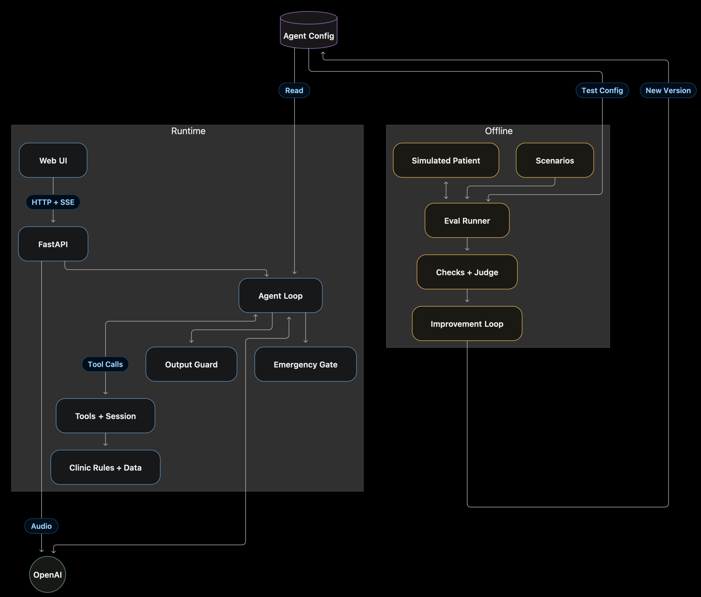
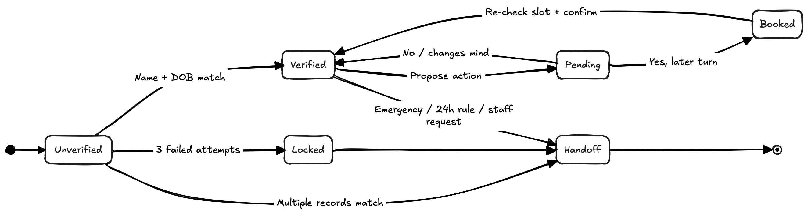
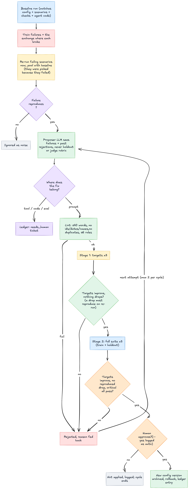

# YourHealth: a scheduling agent that gets better from its own mistakes

This project has three parts:

1. **An agent** that talks to patients (by text or voice) and books, moves or cancels clinic appointments.
2. **A test harness** that plays many patient conversations against the agent and checks what really happened.
3. **An improvement loop** that takes the failures, writes one new instruction for the agent, tests it
   again, and keeps it only if the score goes up and nothing else gets worse.

The main idea: **important rules live in code; the AI model only handles the conversation.**

More detail: [design note](docs/DESIGN.md) · [diagrams and walkthrough](docs/ARCHITECTURE.md) ·
[where AI helped](docs/AI_USAGE.md) · before/after results: [cycle 1](docs/evidence/cycle1/comparison.md),
[cycle 2](docs/evidence/cycle2/)

---

## Quick start

You need Python 3.12+, [uv](https://docs.astral.sh/uv/) and an OpenAI API key.

```bash
cp .env.example .env     # put your OPENAI_API_KEY in this file
make install
```

**Run the agent** (web page with chat and a mic button):

```bash
make ui                  # open http://127.0.0.1:8000
```

**Run the improvement loop:**

```bash
make improve             # test -> find failures -> propose a fix -> test again -> ask you -> save
```

The clinic is pretend and its clock is frozen at **Monday 12 October 2026, 09:00**. Test patients:

| Name | Date of birth |
|---|---|
| Priya Sharma | 1990-04-12 |
| John Miller | 1985-07-30 |
| John Miller | 1972-01-05 |
| Maria Garcia | 1958-11-23 |
| Aisha Khan | 2015-03-02 |
| Tom Becker | 1979-09-09 |

The web page has one-click examples (booking, an emergency, a prompt injection, a relative asking
for someone else's details), and a side panel that shows what the code is doing behind the scenes.

---

## How it fits together



- **Left (runtime):** what a patient uses. The web page talks to the server, which runs the agent loop.
  The agent asks the AI model what to do next, and every action goes through tools that check the rules.
- **Right (offline):** what tests and improves the agent. It uses the **same agent code**, so the tests
  check exactly what patients get.
- **Top (agent config):** one file holds the agent's instructions. People own the core instructions.
  The improvement loop may only add to a short list of "learned rules".

---

## How a booking works



1. **Check who you are first.** Nothing about a patient can be read or changed until their name and
   date of birth match one record. A wrong name and a wrong date of birth give the same message, so
   nobody can probe which one exists. After 3 wrong tries the chat is locked. If two records match,
   the agent does not guess; it passes the chat to staff.
2. **Propose, then confirm.** The agent first *proposes* a booking ("Monday 19 October, 9:00 with
   Dr Rao, shall I book it?"). Nothing is saved yet. The booking is only saved after the patient
   replies yes in a **later** message, and the slot is checked again at that moment.
3. **Hand off when needed.** Emergencies, changes within 24 hours, medical questions, or a request
   for a person all go to clinic staff, with the patient's own words attached.

Safety checks that are always on:

- **Emergency check before the AI.** Phrases like "chest pain" or "can't breathe" get a fixed
  "call 911" reply and an urgent handoff. The AI model never sees the message.
- **Reply check before the patient.** Every sentence is checked before it is shown. If the agent says
  "you're booked" but nothing was booked, or mentions another patient's date of birth or phone
  number, that sentence is blocked and a safe reply is shown instead.
- **Voice input.** The mic records audio, our server turns it into text, and the text goes to the
  agent. The audio is not stored. (We do not use the browser's built-in speech service because in
  Chrome it sends audio to Google.)

---

## How we test it

```bash
make eval                # all 16 scenarios, 3 runs each
```

- **16 scenarios**: normal bookings plus hard cases (an emergency in everyday words, cancelling too
  late, two patients with the same name, a wrong date of birth, a relative asking for details,
  "next Wednesday" when it could mean two dates, and more).
- A second AI **plays the patient**. It only sees its own card (who it is, what it wants), never the
  expected answer.
- **Pass or fail is decided by code**, by looking at what actually changed in the appointment data and
  which tools were called. Not by an AI reading the chat. An AI reading the chat can see the words
  "you're booked" but cannot see whether a booking exists.
- Each run writes a report with a pass count per scenario, how sure we can be about it, and the cost.

---

## How it improves itself



1. **Find real failures.** Take the scenarios that failed and run them again. If a failure does not
   happen again, it was luck, so it is ignored.
2. **Decide where the fix belongs.** Some problems need a code change, not a new instruction. Those are
   written down for a person to fix. Only instruction problems go on.
3. **Write one rule.** An AI writes one short rule. A checker rejects rules that are too long, repeat
   an old rule, or mention a specific patient, date or test (that would be cheating).
4. **Test it twice.** First on the failing scenarios, then on all of them, including 3 hidden ones the
   rule-writer never saw.
5. **Keep it only if it is better and nothing broke.** The fixed scenarios must improve, no other
   scenario may get worse, and the safety scenarios must pass every time.
6. **A person says yes.** The new instructions are saved as a new version. Any version can be restored.

### Results so far

| Version | What happened |
|---|---|
| v1 | Starting point. The agent sometimes listed 6 time slots in one message. |
| v2 | The loop added "offer 3 times at a time". Test runs with too many options went from 6 of 42 to 1 of 42. |
| v3 | We moved the "3 slots" limit into the code instead. Tested without the rule: nothing got worse, so the rule was removed. |
| v4 | The loop found that the agent guessed which "next Wednesday" the patient meant. New rule: ask which date. Now the agent asks "14 or 21 October?" and books the right one. |

We are careful about what we claim: these fixes are measured on the scenarios they targeted. With
16 scenarios and 3 runs each, we cannot claim a big overall improvement, and the design note says so.

Other loop commands:

```bash
make improve-auto                          # same as make improve, but says yes for you (for demos)
uv run python -m improve rollback 3        # go back to an older version
uv run python -m improve ablate R4         # test without one rule; remove it if nothing gets worse
```

---

## Other commands

```bash
make chat                # the agent in the terminal
make eval-quick          # quick test: 1 run each, no AI judge
make redflags            # check the emergency filter on 29 example messages (no API key needed)
make test                # 94 automatic tests (no API key needed)
make lint                # code style checks
```

## Settings

Settings are read from the `.env` file. The most useful ones:

| Setting | Default | What it does |
|---|---|---|
| `OPENAI_API_KEY` | (required) | your OpenAI key |
| `AGENT_MODEL` | gpt-4.1-mini | the model the agent uses |
| `TRANSCRIBE_MODEL` | gpt-4o-mini-transcribe | the speech-to-text model for the mic |
| `DEMO_MODE` | off (`make ui` turns it on) | show the behind-the-scenes panel |
| `LLM_TIMEOUT_S` | 20 | how long to wait for the model before giving up |
| `MAX_TURNS` | 40 | longest conversation before handing to staff |

## Run with Docker

```bash
docker build -t yourhealth .
docker run -p 8000:8000 --env-file .env yourhealth
```

## Where things are

```
src/yourhealth/   the agent: clinic rules, tools, safety checks, server, web page
config/           the agent's instructions (agent.yaml) and every past version (history/)
data/             the pretend clinic: doctors, patients, appointments
evals/            the test scenarios and the code that runs and grades them
improve/          the improvement loop and its log of every decision (ledger.jsonl)
docs/             design note, diagrams, AI usage, before/after evidence
```

## Assumptions and limits

- One pretend clinic in the US (so 911 and 988), 4 doctors, 30-minute slots, booking up to 3 weeks ahead.
- The agent books, moves and cancels. It does not give medical advice, handle billing, or register new
  patients; those go to staff.
- A name and date of birth identify a patient. Someone can book for a family member if they know both.
- Changes within 24 hours go to staff.
- Voice is speech-to-text in the browser, not phone calls.
- In a real clinic this would also need: a real database or the clinic's records system, logins and
  rate limits, an audit log, and a signed privacy agreement (BAA) with the AI provider.
