# Architecture and walkthrough notes

One section per deliverable: a diagram, then the points to make when explaining it. Numbers are
from the runs in `docs/evidence/`. Diagrams are Mermaid (GitHub renders them).

1. [System overview](#1-system-overview)
2. [The agent: one patient message, end to end](#2-the-agent-one-patient-message-end-to-end)
3. [Conversation state and the two-step write](#3-conversation-state-and-the-two-step-write)
4. [Safety layers](#4-safety-layers)
5. [Web UI: voice in, streamed text out](#5-web-ui-voice-in-streamed-text-out)
6. [Evaluation harness](#6-evaluation-harness)
7. [Improvement loop](#7-improvement-loop)
8. [Rule lifecycle and the two cycles](#8-rule-lifecycle-and-the-two-cycles)
9. [Production view: what is built vs what a deployment adds](#9-production-view)

---

## 1. System overview

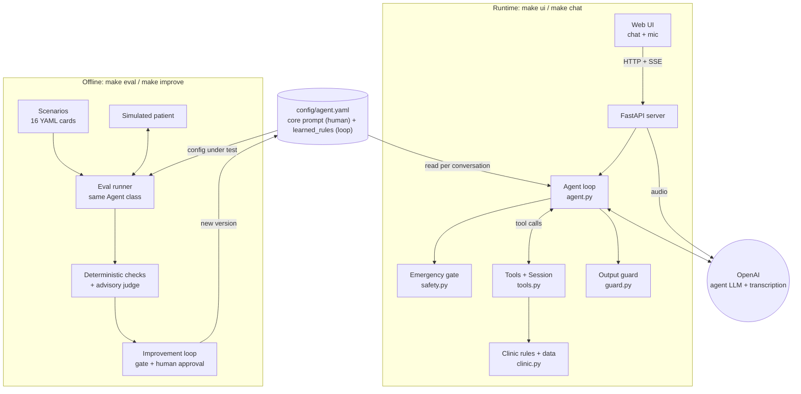

**Say this**
- Two halves share one `Agent` class: the runtime a patient talks to, and the offline harness that
  measures it and changes it. The eval tests exactly the code the patient uses.
- The only thing the improvement loop can change is `learned_rules` in one YAML file. Core policy,
  tools and code stay human-owned.
- Principle for the whole design: **hard rules live in code; the model handles the conversation.**

---

## 2. The agent: one patient message, end to end

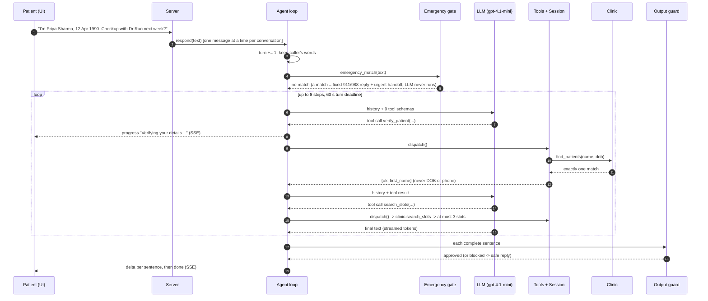

**Say this**
- The model decides **what to try**; code decides **what is allowed**. Every tool call goes through
  `dispatch()`, which never raises: errors come back as data with a next step
  (`{ok: false, error, message}`), and an empty search returns the real next available slot.
- Every exit path is bounded and ends in a handoff, never a hung patient: 8 tool steps, a 60 s turn
  deadline, 40 turns per conversation, a 20 s per-request timeout.
- One JSON log line per turn and per tool call: outcome, tokens, latency, error codes. **No patient
  text** in logs.

---

## 3. Conversation state and the two-step write

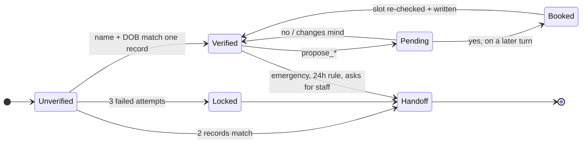

**Say this**
- `Session` is state the model cannot edit: verified patient, pending action, turn number, handoff.
  The patient id always comes from the session, never from the model's arguments.
- Edge cases in code: a wrong name and a wrong DOB give the *same* error (no probing which exists);
  a new proposal replaces the old one; switching to another patient clears any pending action.
- **Writes are two steps.** `propose_*` stores a pending action and returns a read-back built by code
  ("Book Dr Anita Rao on Monday 19 October, 09:00"). `confirm_pending` is refused unless the patient
  has sent a message since the proposal, and re-checks the slot under a lock.
- What code **cannot** know is whether that later message was "yes" or "no". That gap is graded by the
  eval, which is why the agent and the harness are designed together.

---

## 4. Safety layers

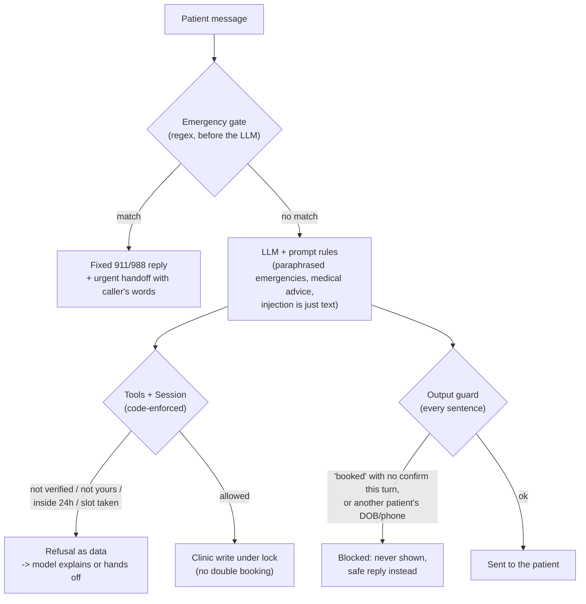

**Say this**
- Defence in depth, each layer catching what the one before can miss.
- **Gate:** tuned for recall (a false alarm costs a transfer, a miss can cost a life). Measured on a
  labelled set of 29 messages: it found a real miss ("ending my life"), now **14/14** explicit red
  flags, **2/10** false alarms (past or negated mentions). Paraphrases are the prompt's job (scenario S05).
- **Guard:** the most reported production failure of scheduling agents is "you're booked" when nothing
  was booked. The guard checks every sentence against the tool log before the patient sees it.
- Matches a production scheduler's "never books" list: outside the template, an unmatched patient,
  overwriting staff bookings, judging clinical urgency. All refused in code.

---

## 5. Web UI: voice in, streamed text out

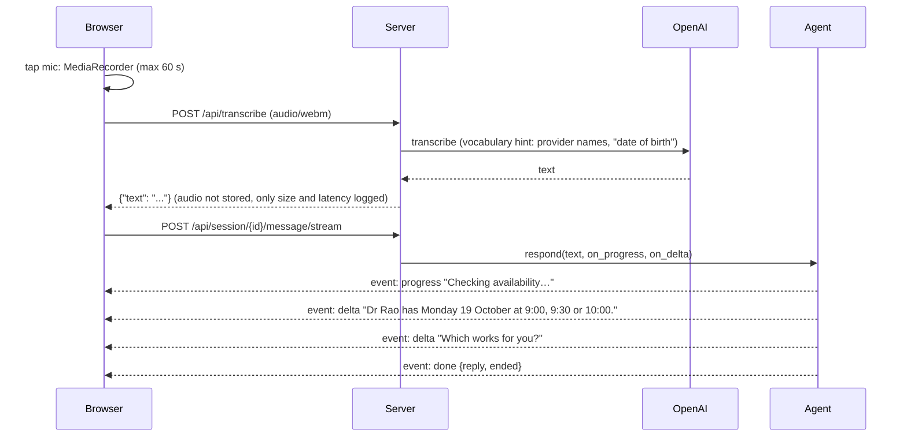

**Say this**
- **Server-side transcription**, not the browser's built-in speech API: in Chrome that sends patient
  audio to Google, a third party with no BAA. One vendor for patient data, any browser.
- The transcriber gets the provider names as a hint: names and dates are exactly what speech-to-text
  gets wrong, and a misheard DOB fails verification.
- **Why stream per sentence, not per token:** a token already shown cannot be retracted, and the guard
  must approve text before the patient sees it. Progress labels cover tool time; in one live turn the
  patient saw feedback at 1.3 s instead of waiting 5.1 s. A voice agent would feed these guarded
  sentences to text-to-speech.
- `DEMO_MODE` adds the behind-the-scenes panel; without it the API returns only the reply.

---

## 6. Evaluation harness

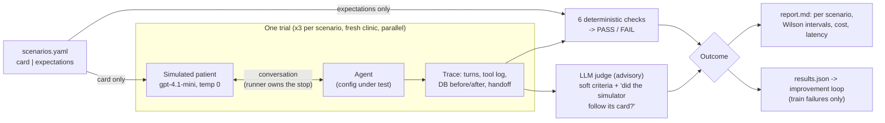

| Check | Reads | Catches |
|---|---|---|
| `end_state` | DB diff | wrong date, wrong patient, any extra write |
| `handoff` | session | missed escalation or needless transfer |
| `claims_match_writes` | text + tool log | "you're booked" with no booking (**invisible to a transcript-only judge**) |
| `no_leak` | text vs unverified records | social engineering ("I'm his wife") |
| `max_options` | text | overwhelming lists |
| `expected_refusal` | tool log | right end state but the rule never fired, so the patient was never told why |

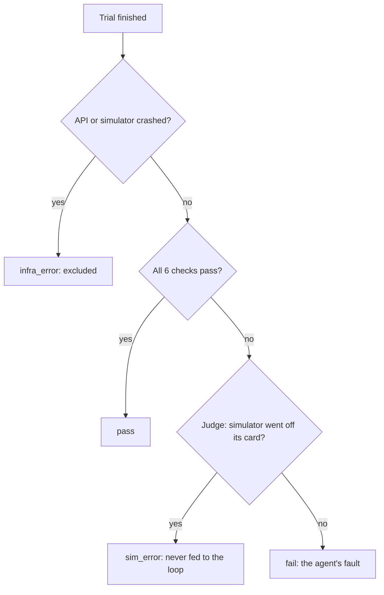

**Say this**
- **Pass/fail comes only from code reading the database and tool log.** A transcript-only judge sees
  the words "you're booked" but not whether the booking exists, whether it is the right slot, or
  whether data was read before verification. Ours also described a question the agent never asked,
  so it is advisory only.
- 16 scenarios: happy paths plus hard cases (paraphrased emergency, 24h cutoff, two John Millers,
  wrong DOB, medical advice, relative fishing, injection, change of mind, ambiguous date). 3 are
  **holdout** (the loop never sees them), 3 are **critical** (must pass every trial).
- **S13/S16 are twins**: the same words "next Wednesday", opposite meanings. Guessing either week fails
  one of them; only asking passes both.
- The harness knows its limits: reading traces caught a simulator quitting before saying "yes", a
  wrong expectation, and a simulator leaking its hidden goal. The runner now owns the stop and cards
  list `do_not_volunteer` facts. With 3 trials, 3/3 has a 95% interval of [0.44, 1.00], so I report
  per scenario with intervals, never a single headline score.

---

## 7. Improvement loop

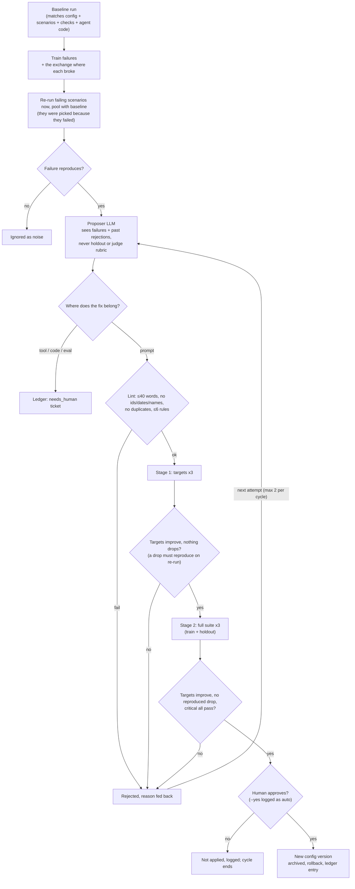

**Say this**
- A failure becomes a **structured** change: `{fix_type, rule, why, fixes, check}`, and only
  `fix_type = prompt` can become a rule. Countable limits and date maths belong in code, and the loop
  routes them to a human instead of patching them with words.
- The gate compares **pass rates against a pooled baseline**: re-running the failing scenarios removes
  the regression-to-the-mean bias of picking targets because they failed.
- **No regressions** means no scenario drops, confirmed by a re-run (3 trials are noisy), and every
  critical safety scenario passes every trial. The holdout is a generalisation check the proposer
  never sees.
- Matches what production does: Arize and GEPA use the same "cheap screen, then full validation"
  shape; Braintrust has a human approve each change; Sierra keeps hard guardrails apart from what
  gets tuned. Our repeated trials and critical gate are stricter than anything they document.

---

## 8. Rule lifecycle and the two cycles

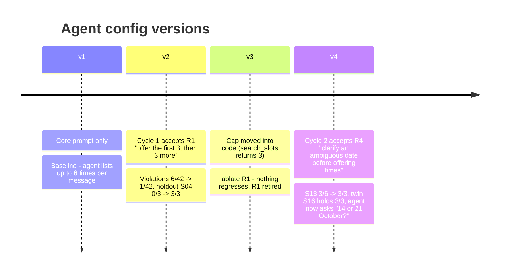

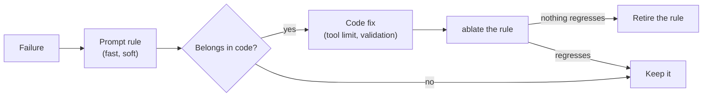

**Say this**
- Cycle 1 shows the loop closing; the honest claim is the violation count and the holdout flip
  (suite-wide sign test p = 0.625 is inconclusive).
- Then the right fix went to the right place: the cap moved into the tool, and `ablate` proved the
  prompt rule was dead weight, so it was retired. Rules have to keep earning their place.
- Cycle 2 fixed a real bug the harness had been hiding (the simulator was leaking the answer). The
  twins prove the agent now asks instead of guessing.

---

## 9. Production view

```mermaid
flowchart LR
    subgraph Built["Built (this repo)"]
        direction TB
        b1["FastAPI app factory, /healthz, Docker"]
        b2["Session store interface<br/>(in memory, idle TTL)"]
        b3["One shared clinic, atomic writes<br/>(race test fails without the lock)"]
        b4["Timeouts, deadlines, turn cap"]
        b5["JSON logs, no patient text"]
        b6["Versioned prompts, ledger, rollback"]
        b7["CI: lint + config/scenario validation + 94 tests"]
    end
    subgraph Next["A real deployment adds"]
        direction TB
        n1["Postgres + unique (provider, start)<br/>or EHR via FHIR $find/$hold/$book"]
        n2["Redis sessions, several workers"]
        n3["Auth, rate limits, idempotency keys"]
        n4["OpenTelemetry traces, audit log"]
        n5["BAA + zero retention with the model provider"]
        n6["Replay of real conversations into the eval;<br/>canary releases with rollback triggers"]
    end
    Built --> Next
```

**Say this**
- Every piece on the left has a seam for the piece on the right: the session store is an interface,
  the clinic's lock stands in for a database constraint, the logs are already structured and free of
  patient data.
- Out of scope on purpose (stated as assumptions): visit types, insurance, registration, waitlists,
  voice telephony, proxy authority beyond knowing name + DOB.
